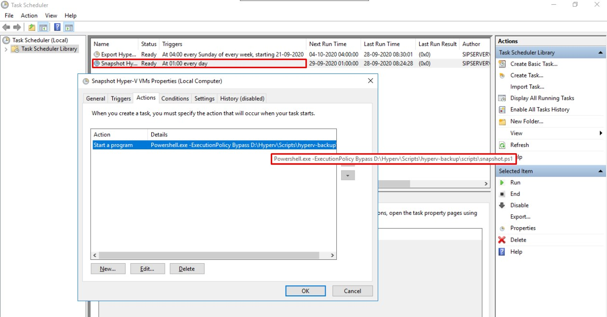

# Hyper-V Backup Scripts

Scripts to backup Hyper-V virtual machines.

## Snapshot

A Hyper-V snapshot (currently known as a Hyper-V checkpoint) represents a point-in-time copy of a selected virtual machine (VM), which allows you to capture the VM state, data, and its hardware configuration at a particular moment. Hyper-V snapshots are primarily used to revert a VM to its previous state in case any unnecessary changes were applied to the VM and the user wants to discard them. The main advantage of this technology is that Hyper-V snapshots can be easily and rapidly taken online and offline, without causing any workflow interruptions within a running VM. In Hyper-V, multiple snapshots can be created, deleted, and applied to a single VM.

Script: `scripts/snapshot.ps1`

## Export

Hyper-V Export is the process of exporting a selected VM, including its virtual hard disk files, VM configuration files, and Hyper-V snapshots, to a single unit. This operation can be performed when the VM is either online or offline. 

Script: `scripts/export.ps1`

## Installation

1. Copy files to the server ([click here to download](https://github.com/vanegmondgroep/hyperv-backup/archive/master.zip)).
2. Open each script and modify the variables to your needs.
3. Create a scheduled task for each script (example below).

